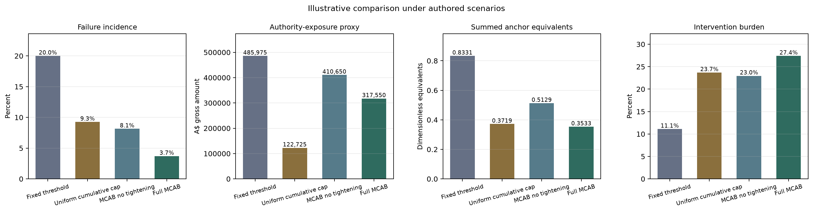

# Materiality-Calibrated Authority Budget prototype

[](https://github.com/skk-dotcom/mcab-authority-budget-prototype/actions/workflows/tests.yml)

This repository is a synthetic research prototype for examining operational authority controls. It illustrates how repeated transactions can remain individually below a fixed threshold while accumulating within a risk cell, and how a materiality-calibrated authority budget can vary across differently scaled synthetic entities. In the authored run, Full MCAB produces fewer missed escalations and greater intervention than the uniform cumulative cap, while their absolute-dollar and scale-relative exposure measures rank differently. It does not validate MCAB professionally or empirically.

## Research problem

A stateless per-transaction threshold cannot recognise cumulative exposure from repeated small transactions. Adding cumulative state can address that specific weakness, but it does not by itself demonstrate the value of calibrating authority to entity scale. This prototype therefore separates cumulative state, entity-relative calibration, and prospective post-error tightening into four policy conditions.

## Financial-statement materiality and operational authority

Financial-statement materiality concerns whether information or misstatement could influence users of financial statements. Operational authority concerns how much economic value an AI agent may exercise without independent review. MCAB uses illustrative materiality anchors to calibrate operational authority budgets. It is not an ASA 320 formula, an auditing standard, a legal approval threshold, or professional guidance.

## MCAB as a research construct

MCAB is defined here as a stateful research design construct that limits cumulative autonomous authority within specified risk cells. Full MCAB can also tighten later budgets after confirmation of an earlier control error. Only autonomously executed amounts consume authority; independently reviewed or blocked amounts do not.

## Synthetic design and entity scales

The deterministic dataset contains 270 positive-amount transactions across procure-to-pay and journal-entry/month-end-close workflows. All identifiers and values are synthetic.

| Entity | Illustrative anchor | Scenario scale | Initial MCAB budget |
|---|---:|---:|---:|
| `ENTITY_SMALL` | A$250,000 | 0.5 | A$25,000 |
| `ENTITY_REFERENCE` | A$500,000 | 1.0 | A$50,000 |
| `ENTITY_LARGE` | A$1,000,000 | 2.0 | A$100,000 |

The common safety factor is `0.10`. The uniform cumulative cap is A$50,000 and therefore matches MCAB for `ENTITY_REFERENCE`. The cumulative risk cell is `(entity, reporting_period, workflow, account, counterparty)`.

Matched aggregation and post-error amount templates are multiplied by the entity scale factors. Qualitative and isolated-significance cases are kept outside the mechanism-identification subsets. Parameters and templates were frozen before revised execution and were not altered in response to the results.

## Policy conditions and mechanism decomposition

| Condition | Cumulative state | Entity calibration | Prospective tightening |
|---|---:|---:|---:|
| Fixed per-transaction threshold | No | No | No |
| Uniform cumulative cap | Yes | No | No |
| MCAB no-tightening ablation | Yes | Yes | No |
| Full MCAB | Yes | Yes | Yes |

The prespecified mechanism comparisons are deliberately narrower than the repository-level comparison:

- fixed threshold → uniform cap uses matched pre-error aggregation rows;
- uniform cap → MCAB no tightening uses those rows separately for each entity; and
- MCAB no tightening → full MCAB uses post-error rows only.

Overall metric differences are descriptive and are not presented as additive mechanism effects.

## Independent oracle and remaining dependence

The oracle applies a separately authored qualitative mapping and non-monetary recurrence rules. In matched pre-error aggregation cells, review begins at occurrence six. After a confirmed control error, later transactions in a fresh post-error cell require review from occurrence three. The signal row affects later adjudication only and does not count as a post-error occurrence. Recurrences six and three are authored demonstration parameters: they are not derived from ASA 240, ASA 320, legislation, or a professional protocol, and sensitivity analysis is used because no professional source supplies these numerical choices.

The oracle module imports no policy implementation or configuration and does not use fixed thresholds, cumulative caps, entity anchors, safety factors, tightening multipliers, policy decisions, or scenario-step boundaries. Policies receive no scenario identifiers, scenario labels, steps, or oracle actions.

The oracle is procedurally isolated and does not use policy monetary parameters. However, both the oracle and the synthetic scenarios remain authored research-design components and have not been independently expert validated. Parametric coupling between the treatment's monetary logic and the oracle's recurrence rule is relocated from the oracle to the authored scenario templates rather than eliminated; this is acceptable for constructive feasibility work but limits external validity.

## Evaluation metrics

The primary measures are:

- overall consequential-failure incidence: missed escalations divided by all transactions;
- conditional miss rate: missed escalations divided by oracle-required escalation transactions;
- gross authority-exposure proxy: gross amount associated with missed escalations; and
- review, block, and combined non-autonomous intervention burden.

Secondary outputs include false escalation rate, aggregation-related failures, qualitative cases correctly escalated, three-action confusion counts, results by entity, sensitivity analysis, and prespecified mechanism decomposition. Every rate is accompanied by its numerator and denominator.

`INDEPENDENT_REVIEW` counts as adequate escalation for the binary miss measure when the oracle requires review or blocking because autonomous authority has been removed. Review and block remain separate in the generated tables.

## Illustrative comparison under authored scenarios

[The complete generated results summary](outputs/results_summary.md) reports all four conditions, entity results, action confusion, mechanism subsets, supplementary exposure measures, and oracle sensitivity. The compact table and chart below use repository-level descriptive results.

<!-- BEGIN GENERATED PRIMARY RESULTS -->
| Policy | Failure incidence | Conditional miss rate | A$ exposure proxy | Summed anchor equivalents | Maximum entity ratio | Combined intervention |
|---|---|---|---|---|---|---|
| Fixed threshold | 54/270 (20.00%) | 54/84 (64.29%) | A$485,975 | 0.8331 | 0.2777 | 30/270 (11.11%) |
| Uniform cumulative cap | 25/270 (9.26%) | 25/84 (29.76%) | A$122,725 | 0.3719 | 0.2777 | 64/270 (23.70%) |
| MCAB no tightening | 22/270 (8.15%) | 22/84 (26.19%) | A$410,650 | 0.5129 | 0.3493 | 62/270 (22.96%) |
| Full MCAB | 10/270 (3.70%) | 10/84 (11.90%) | A$317,550 | 0.3533 | 0.2961 | 74/270 (27.41%) |

Absolute-dollar exposure remains the primary exposure outcome. Summed anchor equivalents and the maximum entity ratio are supplementary scale-relative descriptions and do not define a universal ranking.

### Repository-level calibration contrast

| Repository-level measure | Uniform cap | MCAB no tightening | Observed direction |
|---|---|---|---|
| Absolute-dollar exposure | A$122,725 | A$410,650 | Higher under no tightening |
| Summed anchor-normalised exposure | 0.3719 | 0.5129 | Higher under no tightening |
| Maximum entity-anchor ratio | 0.2777 | 0.3493 | Higher under no tightening |
| Conditional misses | 25/84 (29.76%) | 22/84 (26.19%) | Lower under no tightening |

Calibration Branch B: MCAB without tightening does not reduce summed anchor-normalised exposure relative to the uniform cap. The calibration step therefore does not favour MCAB on this supplementary measure, and the observed result is retained without changing entity anchors, scenario amounts or policy parameters.

On matched pre-error aggregation rows, summed anchor-normalised exposure is 0.1869 under the uniform cap and 0.0486 under MCAB no tightening. These prespecified mechanism-subset values are reported separately and are not inputs to the repository-level branch label.

In this authored dataset, entity-relative calibration improves the matched aggregation subset while weakening control over the isolated-significance vignettes. Its repository-level result therefore depends on the authored mixture of cumulative-risk and isolated-transaction scenarios.

Calibration alone slightly reduces conditional misses but increases absolute-dollar exposure, summed anchor-normalised exposure, and the maximum entity-anchor ratio at repository level. It performs substantially better on the matched aggregation subset; the repository-level exposure result is worse because that subset excludes isolated-significance cases.

### Entity-level distribution behind the aggregate

Each cell is entity consequential-failure exposure divided by that entity's authored anchor.

| Policy | SMALL | REFERENCE | LARGE |
|---|---|---|---|
| Fixed threshold | 0.2777 | 0.2777 | 0.2777 |
| Uniform cumulative cap | 0.2777 | 0.0818 | 0.0124 |
| MCAB no tightening | 0.0818 | 0.0818 | 0.3493 |
| Full MCAB | 0.0286 | 0.0286 | 0.2961 |

In this authored construction, the uniform cap’s entity-level exposure ratio falls from SMALL to LARGE: 0.2777, 0.0818 and 0.0124. Relative to the uniform cap, MCAB without tightening lowers the SMALL ratio, leaves REFERENCE unchanged and raises LARGE; Full MCAB lowers SMALL and REFERENCE but raises LARGE.

The summed MCAB indices are therefore heavily influenced by LARGE isolated-significance exposure and conceal this cross-entity redistribution. These patterns reflect the authored scenarios, anchors and risk composition; they are not evidence of monotonic behaviour across real organisations.

For SMALL, the Fixed and Uniform conditions have the same 18 consequential-failure transaction IDs and the same A$69,425 failed exposure; the oracle requires `INDEPENDENT_REVIEW` and both policies choose `AUTO_EXECUTE` on those failed rows. The A$50,000 uniform cumulative cap therefore did not reduce SMALL consequential-failure exposure relative to the fixed policy in this authored dataset. This does not imply identical behaviour elsewhere or across all actions.

This distribution motivates future research on layered per-transaction, cumulative risk-cell, and cross-entity or group-level authority limits. It does not establish or professionally prescribe such a hierarchy.

### Uniform cap and Full MCAB: mixed repository-level measures

| Measure | Uniform cap | Full MCAB | Lower observed value |
|---|---|---|---|
| Consequential failures | 25/270 | 10/270 | Full MCAB |
| Summed anchor-normalised exposure | 0.3719 | 0.3533 | Full MCAB |
| Absolute-dollar exposure | A$122,725 | A$317,550 | Uniform cap |
| Maximum entity-anchor ratio | 0.2777 | 0.2961 | Uniform cap |
| Combined intervention | 64/270 (23.70%) | 74/270 (27.41%) | Uniform cap |

“Lower observed value” is descriptive and is not a policy-winner designation. These measures are not equally weighted and do not form a composite score.

The summed-ratio difference is 0.0186, approximately 5.0% below the uniform-cap value. Full MCAB exchanges fewer misses and slightly lower summed relative exposure for higher gross-dollar exposure, a higher worst-entity ratio, and more intervention. Overall Branch A reflects the combined Full MCAB design and must not be attributed to calibration alone.

Overall Branch A: Full MCAB has lower summed anchor-normalised exposure than the uniform cap while retaining higher absolute-dollar exposure. The measures diverge because one reports gross dollars and the other scales each consequential failure to its entity’s authored anchor. This divergence is consistent with the intended operation of entity-relative calibration, but it is not evidence that MCAB is effective or generally superior.

### Mechanism-subset and isolated-significance context

Four isolated-significance vignettes in `ENTITY_LARGE` contribute A$267,500 under MCAB no tightening and A$267,500 under Full MCAB, compared with A$0 under the uniform cap. They sit outside the prespecified mechanism-identification subsets.

Aggregation-pressure exposure is A$22,425 lower under Full MCAB, and post-error-accumulation exposure is A$50,250 lower. Mechanism claims should therefore be read from decomposition and ablation contrasts rather than inferred from the headline table alone.

Within the entity-calibrated post-error subset, summed anchor-normalised exposure is 0.1968 without tightening and 0.0372 under Full MCAB. Tightening Branch A: Full MCAB has lower summed anchor-normalised exposure than MCAB without tightening. Within the authored post-error sequences, prospective tightening is associated descriptively with lower scale-relative exposure and a different intervention burden. This is not causal evidence that tightening is effective outside the constructed scenarios.

### Oracle-recurrence ordering

| Configuration | Exact conditional-miss ordering (lowest to highest) |
|---|---|
| 4/3 | Full MCAB < Uniform cumulative cap < MCAB no tightening < Fixed threshold |
| 6/3 | Full MCAB < MCAB no tightening < Uniform cumulative cap < Fixed threshold |
| 8/3 | Full MCAB < MCAB no tightening < Uniform cumulative cap < Fixed threshold |
| 6/2 | Full MCAB < MCAB no tightening < Uniform cumulative cap < Fixed threshold |
| 6/4 | Full MCAB < MCAB no tightening < Uniform cumulative cap < Fixed threshold |

Sensitivity Branch B: The conditional-miss-rate policy ordering changes under 4/3. The base-case ordering is therefore conditional on the authored 6/3 recurrence points. This dependence is retained as a limitation and is not resolved by selecting a preferred configuration or adjusting the recurrence grid.

Full MCAB has the lowest conditional-miss fraction in all five authored configurations, but the complete weak ordering changes under `4/3` because the relation between the uniform cap and MCAB no tightening reverses. The Full-MCAB–no-tightening ordering persists across this narrow recurrence grid. This is local sensitivity within one authored dataset, not independent confirmation, robustness, or external validation.

Under `8/3`, false escalations are 12/198 for the uniform cap, 9/198 for MCAB no tightening, and 9/198 for Full MCAB. The higher false-escalation counts under `8/3` arise from relabelling fixed policy interventions against a more permissive oracle configuration, not from any change in policy behaviour.

The identical `0.2777` Fixed-threshold entity ratios are a product of proportional scenario scaling and proportional entity anchors, not evidence of empirical invariance across differently sized organisations. This matched construction makes the cross-entity comparison cleaner than would ordinarily be expected in operational data.

### Incomplete factorial and future question

| Calibration | No tightening | Tightening |
|---|---|---|
| No entity calibration | Uniform cap | Not implemented |
| Entity calibration | MCAB no tightening | Full MCAB |

The policy ladder is not a complete 2×2 factorial because it contains no uniform-cap-with-tightening condition. The no-tightening–Full-MCAB contrast therefore measures prospective tightening only within entity-calibrated conditions and cannot determine whether the observed tightening result requires, interacts with or generalises beyond entity calibration.

The entity-calibration step does not improve repository-level absolute exposure, summed anchor-normalised exposure, or maximum entity-anchor exposure in this authored dataset; it slightly improves conditional misses and substantially improves the matched aggregation subset. Adding prospective tightening within the entity-calibrated conditions reduces repository-level summed exposure and failures relative to MCAB no tightening. Because uniform-cap-with-tightening is absent, the design cannot determine whether this result depends on calibration or would also occur under a uniform cap. The mechanism decomposition sharpens a future question rather than resolving it.

The mixed results motivate a sharper future question: under what risk compositions does entity-relative authority improve control, and what hierarchy of per-transaction, cumulative risk-cell and cross-entity constraints is required to prevent gains in aggregation control from weakening isolated-transaction control?

Under the maximum entity-anchor exposure ratio, the ranking across the four conditions from lowest to highest is Fixed threshold = Uniform cumulative cap < Full MCAB < MCAB no tightening. The highest single-entity figure is 0.3493 (34.9300%) for MCAB no tightening–ENTITY_LARGE, meaning that this fraction of that entity’s authored anchor was exposed without independent review.
<!-- END GENERATED PRIMARY RESULTS -->



The table's conditional rate uses only oracle-required escalations as its denominator. The chart's failure-incidence percentage uses all 270 transactions. The values therefore answer different questions and should not be compared as if they shared a denominator.

## Sensitivity and ablation analysis

The original generated sensitivity table varies fixed thresholds, uniform cumulative caps, MCAB safety factors, and full-MCAB tightening multipliers over predeclared grids. It also includes matched-reference conditions in which the uniform cap equals the reference entity's MCAB budget. Multiplier `1.00` represents no tightening.

Sensitivity analysis is descriptive. It is not used to select a preferred result after observing the experiment.

## Installation and reproduction

Python 3.11 or later is required. No external service, API key, database, or real company data is used.

### Windows PowerShell

```powershell
py -3 -m venv .venv
.\.venv\Scripts\python.exe -m pip install -r requirements.txt
.\.venv\Scripts\python.exe -m pip install -e .
.\.venv\Scripts\python.exe -m pytest
.\.venv\Scripts\python.exe -m mcab_prototype.run_demo
```

### POSIX shell

```sh
python3 -m venv .venv
.venv/bin/python -m pip install -r requirements.txt
.venv/bin/python -m pip install -e .
.venv/bin/python -m pytest
.venv/bin/python -m mcab_prototype.run_demo
```

The demo regenerates the synthetic dataset, decision-level policy output, repository- and entity-level metrics, mechanism decomposition, sensitivity tables, action confusion table, supplementary policy metrics, absolute-dollar exposure decomposition, generated Markdown summary, README results block, and chart. The three Revision 2 supplementary CSVs are `outputs/supplementary_policy_metrics.csv`, `outputs/exposure_difference_decomposition.csv`, and `outputs/oracle_sensitivity_analysis.csv`.

## Limitations

- The oracle and synthetic scenarios are authored and have not been independently expert validated.
- Entity anchors, the safety factor, recurrence counts, cell granularity, scenario order, and sensitivity grids are illustrative choices.
- Proportional entity scaling and authored matched scenarios are constructive design choices. The calibration comparison illustrates policy behaviour under this design and does not empirically validate the selected anchors or scale ratios.
- The identical `0.2777` Fixed-threshold entity ratios are a product of proportional scenario scaling and proportional entity anchors, not evidence of empirical invariance across differently sized organisations. This matched construction makes the cross-entity comparison cleaner than would ordinarily be expected in operational data.
- Isolated-significance judgements remain authored and are excluded from mechanism decomposition.
- The frozen dataset has no individual amounts above A$25,000 and at or below A$50,000, so the fixed-threshold sensitivity has sparse support in that interval.
- Qualitative flags are assumed to be observed accurately and without cost.
- Gross transaction amount represents authority exposure, not realised loss or financial-statement misstatement.
- Reviewer error and dependence, strategic adaptation, delay, operating cost, containment, recovery, and realised outcomes are omitted.
- One deterministic dataset supports reproducibility, not statistical inference, causal attribution, external validity, or generalisation to real organisations or autonomous agents.
- A committed PNG may render differently across operating systems because the complete font and rendering stack is not pinned; tests validate source values and rendering structure instead of cross-platform byte identity.
- The supplementary scale-relative measures were added after the original absolute-dollar results were known. Their alternative interpretations were publicly committed before formal computation, but the procedure was neither blinded nor formally preregistered because the existing data and anchors made the likely direction inferable. Full procedural detail is recorded in `DECISIONS.md`.
- Summed anchor equivalents combine failure incidence and relative failure size across entities without a natural single-entity interpretation; the maximum ratio may depend on one entity and a small number of authored cases. These measures alter interpretation, not the underlying transactions, decisions, oracle labels, or original evidence.
- The policy ladder is not a complete 2×2 factorial because it contains no uniform-cap-with-tightening condition. The no-tightening–Full-MCAB contrast therefore measures prospective tightening only within entity-calibrated conditions and cannot determine whether the observed tightening result requires, interacts with or generalises beyond entity calibration.

## Future research

Proposed extensions include a confidence-based escalation baseline, multiple model and reviewer-independence conditions, repeated stochastic agent runs, expert-validated adjudication, and hierarchical statistical analysis across transactions, cells, workflows, agents, and reviewers. The mixed results motivate a sharper future question: under what risk compositions does entity-relative authority improve control, and what hierarchy of per-transaction, cumulative risk-cell and cross-entity constraints is required to prevent gains in aggregation control from weakening isolated-transaction control?

[ASA 600 paragraph 35(a)](https://standards.auasb.gov.au/asa-600-may-2022-0) requires component performance materiality to be lower than group performance materiality to address aggregation risk. This provides a conceptual accounting analogy for investigating a hierarchy in which entity-relative authority budgets operate beneath an additional cross-entity constraint. It is an audit-planning analogy only: ASA 600 does not prescribe MCAB, operational approval thresholds, transaction caps, or authority budgets. The hierarchy remains an untested future-design hypothesis.

## AI-assisted research engineering

Development responsibilities and validation procedures are disclosed in [AI_USE.md](AI_USE.md). This repository is a human-directed, AI-assisted implementation; responsibility for assumptions, interpretation, and scholarly use remains with the human researcher.

## Licence

Released under the [MIT License](LICENSE). This research software provides no professional assurance or accounting guidance.
